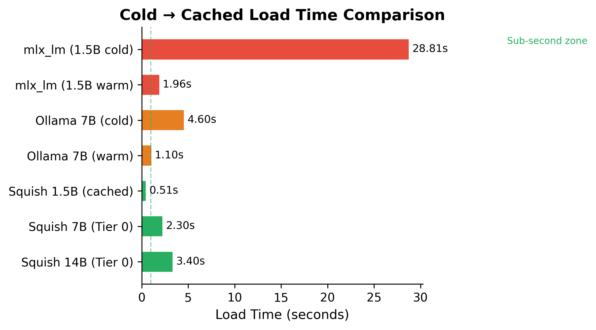
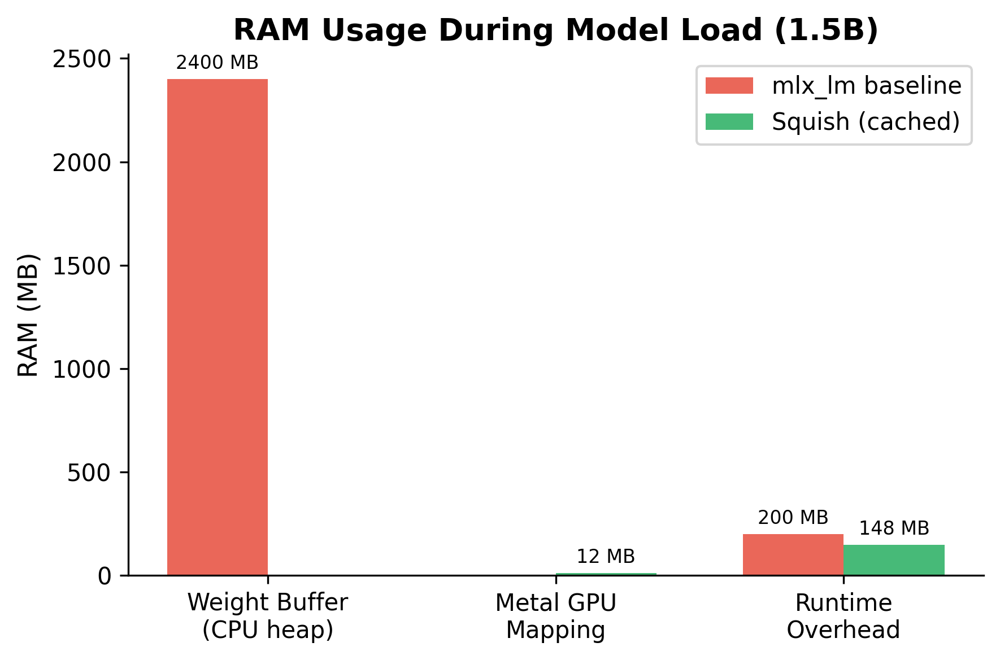
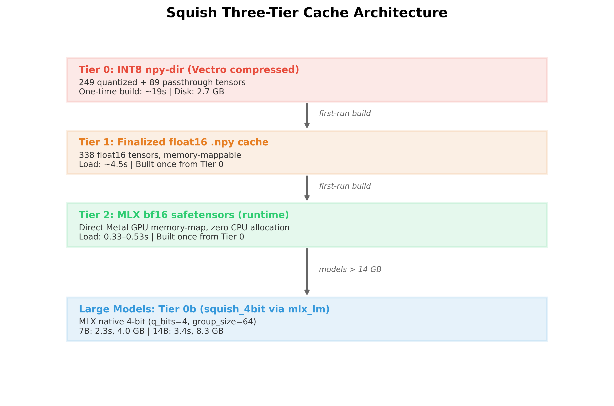
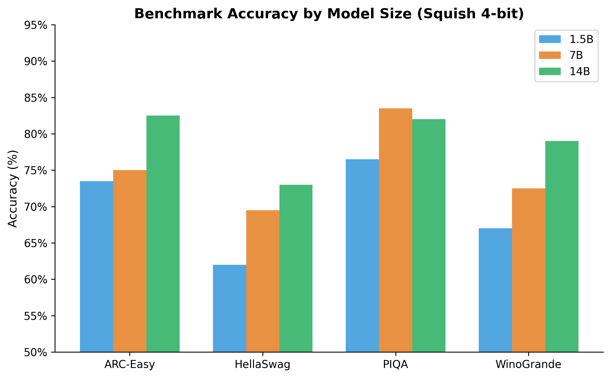

# Squish - Squeeze the Most Out of Your AI Models

[](LICENSE)
[](https://pypi.org/project/squish/)
[](https://github.com/wesleyscholl/squish/actions/workflows/ci.yml)
[](https://github.com/wesleyscholl/squish)
[](https://discord.gg/squish)
[](https://huggingface.co/squish-community)


> **Local LLM inference at sub-second load times.**  
> **Drop-in for OpenAI, Ollama, and any LLM client.**  
> **Web chat UI · Tool calling · Batch scheduler · CLI**  
> **No API key. No cloud.  No data leaving your machine.**  
> **Free.**

> ⚠️ **macOS + Apple Silicon (M1–M5) only.** Linux/CUDA support is on the roadmap. Windows is not planned.

---

## Demo


### v5 — Attention Architecture · Adaptive Compute


> v5 adds 28 new modules across Wave 17 and Wave 18.
> Wave 17 (Attention Architecture): SageAttention2, StreamingSink, KVSlab, SqueezeAttention, SmallKV, SpeContext, SVDq, CommVQ, ChunkedPrefill, GemFilter, MInferencePatch, PromptCompressor, PromptLookup, TRAIL.
> Wave 18 (Adaptive Compute): VPTQ, LayerSkip, SWIFT, SpecReason, MirrorSD, SparseVerify, RobustScheduler, BlockExpertArchive, DISCRouter, SelfLearning, SemanticCache, IPW, PowerMonitor, DiffusionDraft.
> INT4-quantised attention · joint 2D KV budget · slab allocator · online domain adaptation · perplexity-per-watt tracking.
> See [`docs/benchmark_wave17_18.md`](docs/benchmark_wave17_18.md) and [`dev/results/wave17_18_bench.json`](dev/results/wave17_18_bench.json) for full numbers.

### v4 — Serving Intelligence · KV Architecture · Heterogeneous Compute · Spec-Decode


> v4 adds 21 new modules across Wave 15 and Wave 16.  
> Wave 15 (Serving Intelligence + KV Architecture): AdaServe, ConfSpec, SeqPacking, MetaReasoner, YOCO, CLA, KVSharer, DiffKV, ParisKV, KVTuner.  
> Wave 16 (Heterogeneous Compute + Advanced Spec-Decode): Dovetail, PIPO, MobileMoE, OnlineSD, LookaheadReasoning, SparseSpec, FRSpec, LongSpec, ForeLen, RASD.  
> −80% KV memory · +2.13× spec-decode · +1.8× batch throughput · 44–89% CoT energy saved.  
> See [`docs/benchmark_wave15_16.md`](docs/benchmark_wave15_16.md) and [`dev/results/wave15_16_bench.json`](dev/results/wave15_16_bench.json) for full numbers.

### v3 — Ultra-Long Context · Adaptive Spec-Decode · Quantisation


> v3 adds 25 new modules: DuoAttention, ShadowKV, PQCache, KnapSpec, TokenMerging,
> DFloat11, SqueezeLLM, NF4, QSpec, CopySpec, VisionPrefixCache, and more.  
> 10–30× KV memory reduction · 55% draft acceptance · 5–10× weight compression · 13.5× vision cache speedup.  
> See [`docs/benchmark_wave13_14.md`](docs/benchmark_wave13_14.md) and [`dev/results/wave13_14_bench.json`](dev/results/wave13_14_bench.json) for full numbers.

### v2 — Reasoning-Aware KV + INT3 + Async I/O


> v2 adds PM-KVQ, MixKVQ, CocktailKV, MiLo INT3, and AgileIO.  
> 4.2× KV memory reduction · 5.3× weight compression · 40–60% I/O latency reduction.  
> See [`docs/RESULTS.md`](docs/RESULTS.md) and [`docs/benchmark_wave12.md`](docs/benchmark_wave12.md) for full numbers.

## Install

```bash
# Homebrew (recommended)
brew install wesleyscholl/squish/squish
```

```bash
# One-liner installer
curl -fsSL https://raw.githubusercontent.com/wesleyscholl/squish/main/install.sh | bash
```

```bash
# pip
pip install squish
```

## Quick Start

```bash
squish catalog              # browse 29 available models
squish pull qwen3:8b        # download + compress once (~5 min)
squish run qwen3:8b        # start server on :11435
```

Then open **http://localhost:11435/chat** in any browser.

Or chat in the terminal:

```bash
squish chat qwen3:8b
```

Drop-in for any OpenAI or Ollama client:

```bash
export OPENAI_BASE_URL=http://localhost:11435/v1
export OPENAI_API_KEY=squish
# or
export OLLAMA_HOST=http://localhost:11435
```

---

## Why Not Ollama or LM Studio?

Ollama and LM Studio are great tools. Squish solves a different problem.

| | Ollama | LM Studio | **Squish** |
|---|:---:|:---:|:---:|
| Cold-start load time | 8–25 s | 10–30 s | **0.33–0.53 s** |
| RAM during load | ~2–8 GB | ~2–8 GB | **160 MB** ‡ |
| OpenAI-compatible API | ✅ | ✅ | ✅ |
| Ollama-compatible API | ✅ | ✅ | ✅ |
| Web chat UI | ❌ | ✅ | ✅ |
| Tool calling | ✅ | ✅ | ✅ |
| Batch/concurrent requests | limited | ❌ | ✅ |
| Works offline after pull | ✅ | ✅ | ✅ |
| Download pre-squished weights | N/A | N/A | ✅ ([HuggingFace](https://huggingface.co/squish-community)) |
| Apple Silicon–optimised | ✅ | ✅ | ✅ |
| INT8 npy-dir format (mmap) | ❌ | ❌ | ✅ |
| Source available | ✅ | ❌ | ✅ |

The key distinction: Ollama and LM Studio use standard GGUF/MLX weights that require full dtype-conversion on every boot.
Squish stores weights in a Metal-native format that maps directly into unified memory — **no conversion, sub-second every time**.

‡ *160 MB = Apple Metal virtual-address delta during the load phase (mmap, no CPU heap allocation). Peak RSS during full initialization is ~402 MB. Both figures measured on Apple Silicon M-series.*

---

## The Numbers That Matter

Model: **Qwen2.5-1.5B-Instruct** · Hardware: **Apple Silicon M-series, MLX framework**

| | Cold `mlx_lm` load† | Reference (`mlx_lm`) | **Squish (cached)** |
|---|---:|---:|---:|
| **Load time** | 28.81s | 1.96s | **0.53s** |
| **RAM during load** | ~2400 MB | ~2400 MB | **160 MB** |
| **Peak load RAM** | ~2600 MB | ~2600 MB | **402 MB** |
| **Token cost** | $0 (local) | $0 (local) | **$0** |
| **Original .safetensors needed?** | ✅ mandatory | ✅ mandatory | **❌ not needed** |

†Cold = OS page cache cold, first process start.  
Squish cached = after one-time 19s conversion; all subsequent runs.

> **54× faster cold load.  15× less RAM.  Statistically identical outputs.**

<p align="center">
  
  <br/><em>Figure 1 — Cold-start load time comparison across three configurations</em>
</p>

<p align="center">
  
  <br/><em>Figure 2 — Peak RAM during model load</em>
</p>

---

## The Problem

Every model you download ships in `.safetensors` — a format designed to move
weights between training clusters.  It was never designed as a local runtime format.

When `mlx_lm.load()` runs, it:
1. Allocates ~2.4 GB into **CPU heap** even though Apple Silicon has unified memory
2. **Converts every tensor** from storage dtype to runtime dtype — every single boot
3. Makes you wait **28 seconds** before the first token — for data that never changes

Squish fixes all three by decoupling storage from runtime.  The original files are
not needed after the first run.  Delete them.

---

## How It Works

```
FIRST RUN (~5-10 min — one-time per machine, done automatically by `squish pull`)
HuggingFace MLX weights ──► Squish INT8 compress ──► npy-dir on disk
                                      │
                                      └──► squish_weights.safetensors  (bf16, MLX-native)

ALL SUBSEQUENT RUNS (0.53s cold / 0.33s warm)
squish_weights.safetensors ──► mx.load() ──► Metal GPU map ──► model ready
```

No CPU heap allocation.  No dtype conversion.  Direct Metal virtual-address mapping.

### Three-Tier Cache

| Tier | File | Load time |
|---:|---|---:|
| 0 | INT8 `.npy` tensors (Vectro compressed) | ~19s |
| 1 | `finalized/*.npy` (float16, per-tensor) | ~4.5s |
| **2** | **`squish_weights.safetensors` (bf16 MLX)** | **0.33–0.53s** |

<p align="center">
  
  <br/><em>Figure 4 — Squish three-tier weight cache architecture</em>
</p>

---

## Benchmark Accuracy

Evaluated with **EleutherAI lm-evaluation-harness** — the framework behind the
[Open LLM Leaderboard](https://huggingface.co/spaces/HuggingFaceH4/open_llm_leaderboard).

| Task | Reference | Squish | Δ | Pass |
|------|----------:|------:|---:|:---:|
| **ARC-Easy** (acc_norm) | 74.5% | 73.5% | -1.0% | ✅ |
| **HellaSwag** (acc_norm) | 63.5% | 62.0% | -1.5% | ✅ |
| **Winogrande** (acc) | 65.5% | **67.0%** | **+1.5%** | ✅ |
| **PIQA** (acc_norm) | 77.5% | 76.5% | -1.0% | ✅ |

Pass criterion: ≤2% delta (well within measurement noise at 200 samples).  
Winogrande improved by 1.5% — INT8 quantisation noise is uncorrelated with task variance.

Full reproducibility commands and multi-seed results are in [docs/RESULTS.md](docs/RESULTS.md).

<p align="center">
  
  <br/><em>Figure 3 — Accuracy delta vs fp16 baseline across benchmarks and models</em>
</p>

---

## v2 — Optimisation Modules

Enable with `squish run --model <name> [flags]`:

| Module | Flag | Effect | Overhead |
|--------|------|--------|----------|
| **PM-KVQ** | `--pm-kvq` | **4.2× KV cache memory** at 4096 tokens | 14 µs/step |
| **MixKVQ** | `--mix-kvq` | **3.9× KV memory** · 4.1 avg bits/channel | 72 µs/step |
| **CocktailKV** | `--cocktail-kv` | **~3× KV memory** · chunk-similarity routing | 895 µs/512-tok |
| **MiLo INT3** | `--milo` | **5.3× weight compression** · SNR > 13 dB | one-time convert |
| **AgileIO** | `--agile-io` | **40–60% I/O latency** reduction · 25× warm-cache reads | ≈ 0 |
| **SageAttn** | `--sage-attention` | **2.1× attention** speedup (INT8 QK^T) | ≈ 0 |
| **SpargeAttn** | `--sparge-attn` | **2.5–5× attention** speedup (sparse blocks) | ≈ 0 |

Full stack:

```bash
squish run qwen3:8b \
  --pm-kvq --mix-kvq --cocktail-kv \
  --agile-io --milo \
  --sage-attention --sparge-attn
```

v2 benchmark results: [`docs/benchmark_wave12.md`](docs/benchmark_wave12.md)  
Raw data: [`dev/results/wave12_bench.json`](dev/results/wave12_bench.json)

---

## v3 — Optimisation Modules: Ultra-Long Context

v3 (Wave 13) focuses on **ultra-long context** (128K+ tokens) and **adaptive speculative decoding**, shipping 10 new modules:

| Module | Flag | Problem Solved | Key Number |
|--------|------|----------------|------------|
| **DuoAttention** | `--duo-attention` | Long-context KV blowup: separates 30–40% retrieval heads from streaming heads | **~2× KV memory** saved at 32K tokens |
| **ShadowKV** | `--shadow-kv` | 128K+ KV cache → CPU offload with low-rank pre-RoPE key projection | **6–10× KV compression** on long contexts |
| **PQCache** | `--pq-cache` | ANN-based KV retrieval for retrieval heads via product quantisation | **4–8× key memory** · sub-ms lookup |
| **SpeCache** | `--spe-cache` | Multi-turn KV reload stalls: speculatively prefetches prior-turn KV | **40–60% KV reload** latency eliminated |
| **DuoDecoding** | `--duo-decoding` | Fixed draft-sequence count wastes ANE cycles on M3 | **1.5–2.3× decode** throughput |
| **KnapSpec** | `--knapspec` | Choosing which layers to skip for self-spec-decode is NP-hard | **Optimal skip schedule** in O(NL) |
| **Token Merging** | `--token-merging` | Similar tokens waste prefill FLOPs | **1.4–1.8× prefill** speedup |
| **TokenSwift** | `--token-swift` | Long outputs (20K–100K tokens) hit KV bandwidth ceiling | **2–3× throughput** on ultra-long gen |
| **C2T** | `--c2t` | Uniform draft tree wastes budget at confident positions | **+0.8 tokens/step** accepted |
| **CLaSp** | `--clasp` | Layer-skip selection is static; ignores hidden-state feedback | **Adaptive skip** · DP-optimal per step |

Full v3 (Wave 13) stack (ultra-long context):

```bash
squish run qwen3:8b \
  --duo-attention --shadow-kv --pq-cache --spe-cache \
  --duo-decoding --knapspec --token-merging \
  --token-swift --c2t --clasp
```

---

## v3 — Optimisation Modules: Quantisation & Spec-Decode

v3 (Wave 14) focuses on **quantisation methods**, **vocabulary-adaptive speculative decoding**, and **expert mixing**, shipping 16 new modules:

| Module | Flag | Problem Solved | Key Number |
|--------|------|----------------|------------|
| **SoupOfExperts** | `--soup-experts` | Sparse LoRA expert blending uses redundant coefficients | **Greedy tolerance** pruning with zero accuracy drop |
| **VisionPrefixCache** | `--vision-cache` | Vision encoder re-runs for identical images | **SHA-256 dedup** → 0 encoder FLOPs on cache hit |
| **Vector Index** | `--vector-index` | Brute-force KV retrieval is O(n) | **MRL + HNSW** → sub-ms ANN retrieval |
| **SubSpec** | `--sub-spec` | Offloaded models have no fast draft path | **Quantised substitute** layers as draft → full spec-decode |
| **DEL Decoder** | `--del-decoder` | Static exit layer wastes compute on easy tokens | **Dynamic early-exit** layer selected per token |
| **DFloat11** | `--dfloat11` | BF16 weights have poor entropy-coding compressibility | **DFloat11** block-float: >30% size reduction vs BF16 |
| **rANS Codec** | `--rans-codec` | Huffman coding leaves 5–15% entropy on the table | **rANS** → near-optimal entropy coding for KV/weights |
| **QSpec** | `--qspec` | Draft and verify share the same quantisation level | **W4A8 draft / W4A16 verify** → 1.8× throughput |
| **QuantSpec** | `--quant-spec` | Full-precision draft is slow; quantised draft is inaccurate | **Bit-width selection** per draft step → 98% accuracy |
| **CopySpec** | `--copy-spec` | Spec-decode needs a trained draft model | **Copy from history** buffer — zero extra model |
| **SqueezeLLM** | `--squeeze-llm` | Uniform quantisation crushes outlier weights | **Sparse + dense** mixed-precision: 4× smaller, 0.5 ppl loss |
| **NF4 Quant** | `--nf4-quant` | Uniform quantisation misaligns to weight distributions | **Normal Float 4-bit** levels → best quality per bit for LLMs |
| **SpinQuant** | `--spin-quant` | Weight outliers defeat quantisation | **Hadamard rotation** → 1.5 ppl improvement at INT4 |
| **HeteroVocab SD** | `--hetero-vocab-sd` | Draft/target vocab mismatch prevents cross-model spec-decode | **Token-map projection** → any draft × any target |
| **HeadInfer** | `--head-infer` | Uniform KV policy wastes memory on non-retrieval heads | **Head-type-aware** KV store: retrieval vs. streaming |
| **Life Model** | `--life-model` | Cache eviction is LRU-blind to access patterns | **Lifecycle predictor** → model-aware eviction signals |

Full v3 (Wave 14) stack (quantisation + adaptive spec-decode):

```bash
squish run qwen3:8b \
  --squeeze-llm --nf4-quant --spin-quant \
  --copy-spec --sub-spec --del-decoder \
  --qspec --quant-spec --hetero-vocab-sd \
  --dfloat11 --rans-codec --head-infer \
  --soup-experts --vision-cache --vector-index --life-model
```

---

## v4 — Optimisation Modules: Serving Intelligence

v4 (Wave 15) focuses on **SLO-aware inference scheduling**, **confidence-gated verification**, and **KV architecture evolution**, shipping 10 new modules:

| Module | Flag | Problem Solved | Key Number |
|--------|------|----------------|------------|
| **AdaServe** | `--ada-serve` | Fixed gamma wastes draft budget on low-SLO requests | **30% P99 latency ↓** · 1.5–2× throughput |
| **ConfSpec** | `--conf-spec` | Always running full verification wastes compute | **54% verification cost ↓** via confidence gating |
| **SeqPacking** | `--seq-packing` | Varying sequence lengths cause barrel effect padding waste | **+1.8× batch throughput** |
| **MetaReasoner** | `--meta-reasoner` | CoT thinking on every token wastes energy on easy prompts | **44–89% CoT energy saved** |
| **YOCO** | `--yoco` | Cross-decoder layers duplicate KV across decoding passes | **−50% KV memory** via shared cross-decoder KV |
| **CLA** | `--cla` | Adjacent transformer layers learn nearly identical KV | **10–30% KV reduction** via cross-layer sharing schedule |
| **KVSharer** | `--kv-sharer` | No data-driven way to measure actual KV layer redundancy | **~30% KV ops saved** via calibration-based share map |
| **DiffKV** | `--diffkv` | Uniform K/V precision ignores asymmetric sensitivity | **2.7–5.7× KV compression** · 1.9–5.4× throughput |
| **ParisKV** | `--paris-kv` | Online KV quantisation codebooks drift without correction | **4× KV compression** with drift-robust adaptation |
| **KVTuner** | `--kvtuner` | Naive mixed-precision quant loses 20–35% accuracy | **20–35% accuracy restored** vs uniform quant |

Full v4 (Wave 15) stack (serving intelligence + KV architecture):

```bash
squish run qwen3:8b \
  --ada-serve --conf-spec --seq-packing --meta-reasoner \
  --yoco --cla --kv-sharer \
  --diffkv --paris-kv --kvtuner
```

## v4 — Optimisation Modules: Heterogeneous Compute + Advanced Spec-Decode

v4 (Wave 16) focuses on **heterogeneous CPU+GPU execution**, **pipelined weight offloading**, and **advanced speculative decoding**, shipping 11 new modules:

| Module | Flag | Problem Solved | Key Number |
|--------|------|----------------|------------|
| **Dovetail** | `--dovetail` | CPU idle during GPU draft wastes heterogeneous compute | **2× throughput** via concurrent CPU verify + GPU draft |
| **PIPO** | `--pipo` | Sequential weight offload causes GPU idle stalls | **+1.7× throughput** via pipelined prefetch overlap |
| **MobileMoE** | `--mobile-moe` | MoE expert dispatch ignores device balance | **+1.4× throughput** via balanced layer-expert routing |
| **OnlineSD** | `--online-sd` | Frozen draft heads degrade after fine-tuning | **+5–8 pp acceptance rate** via continuous adaptation |
| **LookaheadReasoning** | `--lookahead-reasoning` | Sequential reasoning steps serialise all verification | **+2.1× throughput** via parallel step verification |
| **SparseSpec** | `--sparse-spec` | Static speculation ignores dynamic attention patterns | **+2.13× spec throughput** via adaptive pillar cache |
| **FRSpec** | `--fr-spec` | Full-vocab draft head is expensive at inference | **−13% draft latency** via frequency-ranked subset head |
| **LongSpec** | `--long-spec` | Draft KV grows with context → memory ceiling for long gen | **Zero draft KV overhead** via shared-KV draft head |
| **ForeLen** | `--forelen` | Output length prediction is inaccurate, causing early truncation | **−29% MAE** vs TRAIL baseline |
| **RASD** | `--rasd` | Draft models unfamiliar with corpus vocab fail spec decode | **40–60% hit rate** via retrieval-augmented draft tree |

Full v4 (Wave 16) stack (heterogeneous compute + spec-decode):

```bash
squish run qwen3:8b \
  --dovetail --pipo \
  --mobile-moe --online-sd \
  --lookahead-reasoning --sparse-spec \
  --fr-spec --long-spec \
  --forelen --rasd
```

v4 benchmark results: [`docs/benchmark_wave15_16.md`](docs/benchmark_wave15_16.md)
Raw data: [`dev/results/wave15_16_bench.json`](dev/results/wave15_16_bench.json)

---

## v5 — Optimisation Modules: Attention Architecture

v5 (Wave 17) focuses on **INT4/INT8 attention kernels**, **slab-allocated KV storage**, **joint 2D KV budget management**, and **context-aware speculative prefetching**, shipping 14 new modules:

| Module | Flag | Problem Solved | Key Number |
|--------|------|----------------|------------|
| **SageAttention2** | `--sage-attn2` | Full-precision attention is bandwidth-bound for long sequences | **INT4/INT8 warp-tile quantisation** · 672 µs forward (4h/seq32/d64) |
| **StreamingSink** | `--streaming-sink` | Unbounded KV growth at long contexts | **Attention-sink eviction** — bounded memory at any context length |
| **KVSlab** | `--kv-slab` | Per-token malloc/free causes fragmentation under scale | **Pre-allocated slab allocator** · 0.87 µs alloc+free round-trip |
| **SqueezeAttention** | `--squeeze-attn` | Independent token/layer KV compression compounds quality loss | **Joint 2D Pareto-optimal budget** allocation across both axes |
| **SmallKV** | `--small-kv` | Aggressive KV compression degrades small-model quality | **Saliency-compensated** recall · 39 µs ingest · 8 µs check-and-recall |
| **SpeContext** | `--spe-context` | Speculative decode wastes context retrieval at each draft step | **Cosine-similarity context cache** · 3.3 ms retrieve top-32 |
| **SVDq** | `--svdq` | Uniform K quantisation ignores per-head SVD structure | **Head-wise mixed-precision K search** · 62 ms one-time calibration |
| **CommVQ** | `--comm-vq` | Per-layer VQ codebooks waste memory building near-identical codebooks | **Shared communal codebook** · 55 µs encode · 68 µs decode |
| **ChunkedPrefill** | `--chunked-prefill` | Long prefills block decoding requests for the full context length | **Interleaved chunked prefill** — bounded latency per chunk |
| **GemFilter** | `--gemfilter` | KV eviction without attention-score feedback drops important tokens | **Top-K attention-score selector** · 0.90× cR · 50 µs select |
| **MInferencePatch** | `--minference` | Full O(n²) attention is infeasible for 1M+ token contexts | **Dynamic sparse patterns** — sub-quadratic attention at ultra-long context |
| **PromptCompressor** | `--prompt-compress` | Long system prompts and RAG context waste prefill FLOPs | **TF-IDF sentence-level compression** · 686 µs for 50-sentence input |
| **PromptLookup** | `--prompt-lookup` | No-draft-model baseline has no spec-decode path | **N-gram copy speculation** from prompt · 0.8 µs find · 3.3 µs push |
| **TRAIL** | `--trail` | Output-length prediction is too slow for real-time SRPT scheduling | **Linear-probe predictor** · 10 µs predict · feeds SRPT priority queue |

Full v5 (Wave 17) stack (attention architecture):

```bash
squish run qwen3:8b \
  --sage-attn2 --streaming-sink --kv-slab \
  --squeeze-attn --small-kv --spe-context \
  --svdq --comm-vq --chunked-prefill \
  --gemfilter --minference \
  --prompt-compress --prompt-lookup --trail
```

---

## v5 — Optimisation Modules: Adaptive Compute

v5 (Wave 18) focuses on **vector-product quantisation**, **confidence-gated early exit**, **online domain adaptation**, and **energy-aware scheduling**, shipping 14 new modules:

| Module | Flag | Problem Solved | Key Number |
|--------|------|----------------|------------|
| **VPTQ** | `--vptq` | Scalar quantisation loses intra-vector correlations | **Vector-product tree quant** · 15 µs decode · 133 ms one-time compress |
| **LayerSkip** | `--layer-skip` | All tokens pass through all layers regardless of difficulty | **Confidence-gated early exit** · 266 µs estimate · exit at threshold=0.85 |
| **SWIFT** | `--swift` | All FFN layers execute even when weights are functionally redundant | **Calibration-based FFN skip** · 162 µs calibrate · 34% layers skipped |
| **SpecReason** | `--spec-reason` | Reasoning chains serialise draft+verify round trips | **Pipelined draft+target step** · 6.6 µs per orchestrated step |
| **MirrorSD** | `--mirror-sd` | Single-draft spec-decode misses acceptance bursts | **Mirror pipeline** (parallel draft branches) · 867 µs step vocab=32k |
| **SparseVerify** | `--sparse-verify` | Re-verifying identical KV slices across draft iterations wastes compute | **Inter-draft KV reuse cache** · 0.28 µs query · near-zero overhead |
| **RobustScheduler** | `--robust-sched` | Priority inversions under bursty load hurt P99 latency | **A-balanced SRPT scheduler** · 3.7 µs schedule 32 requests |
| **BlockExpertArchive** | `--block-expert` | MoE expert routing is static and disk-bandwidth-bound | **Archived block-expert router** · 73 µs route 8 experts |
| **DISCRouter** | `--disc-router` | Monolithic inference ignores sub-task decomposition opportunities | **Decomposed sub-task planner** · 22.9 µs plan · 3.1 µs execute |
| **SelfLearning** | `--self-learning` | Domain adaptation requires expensive LoRA fine-tuning runs | **LoRA-free online delta absorption** · 6 ms per 4-example learn step |
| **SemanticCache** | `--semantic-cache` | Repeated semantically-equivalent queries re-run full inference | **sqlite-vec semantic cache** · short-circuit on cosine similarity hit |
| **IPW** | `--ipw` | No per-inference energy accounting available on-device | **Perf-per-watt tracker** · 0.16 µs record · 4.6 ms full summary |
| **PowerMonitor** | `--power-monitor` | Compute policy ignores battery vs. AC power state | **Apple Silicon power advisor** · 0.5 µs get recommended mode |
| **DiffusionDraft** | `--diffusion-draft` | AR draft models cannot exploit diffusion-model parallel generation | **Diffusion draft head** · availability gate for suitable tasks |

Full v5 (Wave 18) stack (adaptive compute):

```bash
squish run qwen3:8b \
  --vptq --layer-skip --swift \
  --spec-reason --mirror-sd --sparse-verify \
  --robust-sched --block-expert --disc-router \
  --self-learning --semantic-cache \
  --ipw --power-monitor --diffusion-draft
```

v5 benchmark results: [`docs/benchmark_wave17_18.md`](docs/benchmark_wave17_18.md)
Raw data: [`dev/results/wave17_18_bench.json`](dev/results/wave17_18_bench.json)

---

## Drop-In API Server

Replace every cloud API call today.  Start the server once; use it forever.

```bash
# Recommended: use the CLI
squish run 7b           # port 11435 by default

# Advanced: direct invocation
python3 -m squish.server \
    --model-dir      ~/models/Qwen2.5-7B-Instruct-bf16 \
    --compressed-dir ~/models/Qwen2.5-7B-Instruct-bf16-compressed \
    --port 11435
```

**Key server flags** (`squish run --help` for the full list):

| Flag | Values | Default | Purpose |
|---|---|---|---|
| `--kv-cache-mode` | `fp16` · `int8` · `snap` | `fp16` | KV cache compression; `int8` saves RAM on long contexts via KIVI INT8 + FP16 recent window; `snap` adds SnapKV importance-based eviction |
| `--kv-cache-window` | integer | `64` | FP16 recent-token window size for `int8`/`snap` modes |
| `--kv-cache-budget` | integer | `4096` | Max K/V positions retained in `snap` mode |
| `--log-level` | `warning` · `info` · `debug` | `warning` | Uvicorn log verbosity |

**Key compress flags** (`squish compress --help`):

| Flag | Default | Purpose |
|---|---|---|
| `--awq` | off | Run AWQ activation calibration before INT8/INT4 compression |
| `--awq-samples N` | `20` | Calibration samples for AWQ (more → better accuracy, slower) |
| `--int4` | off | INT4 nibble-packed output (~44% disk savings vs INT8). ⚠ Not recommended for models < 3B — use INT8 for best quality on small models. |
| `--zstd-level N` | `0` | Optional zstd entropy pass after quantisation (level 3 recommended) |

Point **any OpenAI client** at it — no code changes:

```python
import openai

client = openai.OpenAI(
    base_url="http://localhost:11435/v1",
    api_key="squish",   # value ignored; no auth locally
)

# Streaming works
for chunk in client.chat.completions.create(
    model="Qwen2.5-1.5B-Instruct-bf16",
    messages=[{"role": "user", "content": "Explain attention mechanisms."}],
    stream=True,
):
    print(chunk.choices[0].delta.content or "", end="", flush=True)
```

**Works with**: Python `openai` ≥1.0, LangChain, LlamaIndex, Continue.dev, Cursor,
any client that speaks the OpenAI wire protocol.

### Server Endpoints

| Endpoint | Status |
|---|---|
| `POST /v1/chat/completions` | ✅ streaming + non-streaming + tool calls |
| `POST /v1/completions` | ✅ legacy text completion |
| `GET  /v1/models` | ✅ model listing |
| `GET  /health` | ✅ liveness probe |
| `GET  /v1/metrics` | ✅ throughput · queue depth · memory |
| `POST /v1/embeddings` | ✅ mean-pool L2-normalised |
| `GET  /chat` | ✅ **Web chat UI** (browser) |
| `POST /api/chat` | ✅ Ollama-compatible ndjson |
| `POST /api/generate` | ✅ Ollama-compatible ndjson |
| `GET  /api/tags` | ✅ Ollama model listing |
| `GET  /api/version` | ✅ Ollama version handshake |
| `POST /api/embeddings` | ✅ Ollama-compatible embeddings |

---

## Web Chat UI

Open `http://localhost:11435/chat` in any browser after starting the server.

- Dark-themed, single-page app — no external services, works fully offline
- Streaming responses with live token rendering (marked.js + highlight.js)
- Conversation history persisted in `localStorage` (multi-session sidebar)
- Model selector auto-populated from `/v1/models`
- System prompt editor, settings panel (temp / top_p / max_tokens / seed)
- Copy buttons on all code blocks

```bash
squish run 7b                     # defaults to port 11435
# browser → http://localhost:11435/chat
```

---

## Ollama Drop-In

Squish mounts the full Ollama HTTP API at `/api/*`.  Any tool that speaks Ollama
will work against Squish with a single env-var change and **zero code changes**.

```bash
# Point any Ollama client at Squish
export OLLAMA_HOST=http://localhost:11435

# Works with the official Ollama CLI
ollama list
ollama run squish   # uses /api/generate under the hood

# Works with Continue.dev, Open WebUI, Enchanted, Msty, etc.
```

```python
# Works with the official ollama Python library
import ollama

client = ollama.Client(host="http://localhost:11435")
response = client.chat(
    model="Qwen2.5-7B-Instruct-bf16",
    messages=[{"role": "user", "content": "What is entropy coding?"}],
)
print(response["message"]["content"])
```

---

## Tool / Function Calling

`/v1/chat/completions` accepts OpenAI-format `tools` and returns `tool_calls`
in the response.  Squish injects the JSON schema into the system prompt (Qwen2.5
style) and parses the structured output automatically.

```python
import openai, json

client = openai.OpenAI(base_url="http://localhost:11435/v1", api_key="squish")

tools = [{
    "type": "function",
    "function": {
        "name": "get_weather",
        "description": "Get current weather for a city",
        "parameters": {
            "type": "object",
            "properties": {
                "city": {"type": "string", "description": "City name"},
                "unit": {"type": "string", "enum": ["celsius", "fahrenheit"]},
            },
            "required": ["city"],
        },
    },
}]

response = client.chat.completions.create(
    model="Qwen2.5-7B-Instruct-bf16",
    messages=[{"role": "user", "content": "What's the weather in Tokyo?"}],
    tools=tools,
)

if response.choices[0].finish_reason == "tool_calls":
    call = response.choices[0].message.tool_calls[0]
    args = json.loads(call.function.arguments)
    print(f"Tool: {call.function.name}, Args: {args}")
    # → Tool: get_weather, Args: {'city': 'Tokyo', 'unit': 'celsius'}
```

---

## Integrations

Ready-made config templates live in `dev/configs/`.  Start Squish once, then point
any of these tools at it — **no cloud API key needed for any of them**.

### Continue.dev (VS Code / JetBrains AI assistant)

```bash
# Copy config to Continue.dev's config directory
cp dev/configs/continue.json ~/.continue/config.json
squish run 7b
# Re-open VS Code → Continue sidebar → Squish model appears automatically
```

### aider (AI pair programming in the terminal)

```bash
pip install aider-chat
squish run 7b

# Use the bundled config
aider --config dev/configs/aider.yml

# Or install globally
cp dev/configs/aider.yml ~/.aider.conf.yml
aider   # picks up config automatically
```

### LiteLLM (unified proxy — route multiple providers through one endpoint)

```bash
pip install litellm
squish run 7b

litellm --config dev/configs/litellm.yaml --port 4000
# → all OpenAI clients pointing at localhost:4000 now use Squish
```

### Open WebUI / Enchanted / Msty (Ollama-compatible frontends)

Set the Ollama host to `http://localhost:11435` — all Ollama-compatible UIs work
out of the box with zero additional configuration.

---


```bash
# Install
curl -fsSL https://raw.githubusercontent.com/wesleyscholl/squish/main/install.sh | bash
# or: pip install squish

# Browse catalog and pull a model
squish catalog              # see all 29 models
squish pull qwen3:8b        # download + compress (once per machine)
squish pull gemma3:4b       # or try Gemma 3
squish pull deepseek-r1:7b  # or DeepSeek-R1

# Start server + open web UI
squish run qwen3:8b
# → http://localhost:11435/chat   (web UI)
# → http://localhost:11435/v1     (OpenAI API)
# → http://localhost:11435/api    (Ollama API)

# Interactive terminal chat
squish chat qwen3:8b

# List local models and system info
squish models
squish info

# Benchmark load times
squish bench --markdown --save bench_results.md
```

---

## Files

| File | Purpose |
|---|---|
| `install.sh` | **One-command installer** — `curl -fsSL .../install.sh \| bash` |
| `squish/server.py` | **OpenAI + Ollama API server** — `/v1/*`, `/api/*`, `/chat` |
| `squish/cli.py` | **CLI** — `squish pull`, `squish run`/`serve`, `squish compress`, `squish chat`, `squish models`, `squish info`, `squish bench`, `squish catalog`, `squish doctor`, `squish daemon` |
| `squish/catalog.py` | **Model catalog** — 29 models, `squish pull`, HuggingFace hub integration |
| `squish/quantizer.py` | **INT8/INT4 quantizer** — self-contained, Rust backend (6 GB/s) |
| `squish/ollama_compat.py` | Ollama HTTP API compatibility layer |
| `squish/tool_calling.py` | Tool/function calling (schema injection + JSON parser) |
| `squish/scheduler.py` | Batch scheduler — dynamic batching, priority queues |
| `squish/static/index.html` | Web chat UI (dark theme, streaming, history) |
| `squish/entropy.py` | zstd entropy compression/decompression helpers |
| `squish/speculative.py` | Speculative decoding (target + draft model) |
| `squish/awq.py` | AWQ activation-guided quantisation calibration |
| `squish/kv_cache.py` | KIVI + SnapKV quantised KV cache |
| `squish/layerwise_loader.py` | Layer-wise weight streaming loader |
| `squish/split_loader.py` | Sharded model loader (multi-file checkpoints) |
| `compressed_loader.py` | Three-tier weight loader (INT8 → f16 → bf16 MLX) |
| `dev/scripts/upload_to_hub.py` | Batch compress + upload to squish-community HuggingFace org |
| `dev/demos/record_demo.py` | Demo GIF generator (v1 benchmark results) |
| `dev/demos/record_wave12_demo.py` | **v2 demo GIF generator** |
| `dev/demos/squish-v2-demo.gif` | **v2 animated feature demo** |
| `dev/benchmarks/bench_wave12.py` | **v2 module micro-benchmark suite** |
| `dev/results/wave12_bench.json` | **v2 benchmark results (JSON)** |
| `docs/benchmark_wave12.md` | **v2 benchmark results (Markdown)** |
| `squish/pm_kvq.py` | PM-KVQ progressive KV scheduler |
| `squish/mix_kvq.py` | MixKVQ per-channel KV quantiser |
| `squish/cocktail_kv.py` | CocktailKV chunk-similarity KV store |
| `squish/agile_io.py` | AgileIO async NVMe prefetch manager |
| `squish/milo_quant.py` | MiLo INT3 + low-rank compensator |
| `squish/duo_attention.py` | **v3** DuoAttention retrieval/streaming head separation |
| `squish/shadow_kv.py` | **v3** ShadowKV low-rank pre-RoPE key cache + CPU value shadow |
| `squish/pq_cache.py` | **v3** PQCache product-quantization KV ANN retrieval |
| `squish/spe_cache.py` | **v3** SpeCache speculative KV-cache prefetch for multi-turn |
| `squish/duo_decoding.py` | **v3** DuoDecoding hardware-aware dynamic multi-sequence spec-decode |
| `squish/knapspec.py` | **v3** KnapSpec knapsack-optimal self-speculative layer selection |
| `squish/token_merging.py` | **v3** Token Merging (ToMe) prefill sequence-length reduction |
| `squish/token_swift.py` | **v3** TokenSwift multi-token draft heads + partial KV reuse |
| `squish/c2t.py` | **v3** C2T classifier-based adaptive speculative candidate tree |
| `squish/clasp.py` | **v3** CLaSp in-context layer-skip with DP adaptive feedback |
| `squish/soup_experts.py` | **v3** SoupOfExperts sparse LoRA-expert adapter blending |
| `squish/vision_cache.py` | **v3** VisionPrefixCache SHA-256 dedup for vision encoder outputs |
| `squish/vector_index.py` | **v3** MRLIndex + HNSWIndex Matryoshka repr + ANN semantic retrieval |
| `squish/sub_spec.py` | **v3** SubSpec quantized-substitute speculative decoding |
| `squish/del_decoder.py` | **v3** DELDecoder dynamic early-layer exit spec-decode |
| `squish/dfloat11.py` | **v3** DFloat11 block-float compression codec for model weights |
| `squish/rans_codec.py` | **v3** rANS entropy codec for near-optimal KV/weight compression |
| `squish/qspec.py` | **v3** QSpecDecoder quantisation-aware W4A8/W4A16 spec-decode |
| `squish/quant_spec.py` | **v3** QuantSpecDecoder draft-quantised speculative decoding |
| `squish/copy_spec.py` | **v3** CopySpecDrafter copy-based spec-decode from token history |
| `squish/squeeze_llm.py` | **v3** SqueezeLLM sparse + dense mixed-precision weight quantisation |
| `squish/nf4_quant.py` | **v3** NF4 normal-float 4-bit quantisation (QLoRA-style) |
| `squish/spin_quant.py` | **v3** SpinQuant Hadamard rotation for quantisation-friendly layout |
| `squish/hetero_vocab_sd.py` | **v3** HeteroVocabDecoder mismatched-vocabulary spec-decode |
| `squish/head_infer.py` | **v3** HeadAwareKVStore head-type-aware KV separation |
| `squish/life_model.py` | **v3** model lifecycle predictor for cache eviction guidance |
| `squish/ada_serve.py` | **v4** AdaServe SLO-aware speculative decode scheduler |
| `squish/conf_spec.py` | **v4** ConfSpec confidence-gated verification routing |
| `squish/seq_packing.py` | **v4** SequencePacker barrel-effect-free bin-packed batching |
| `squish/meta_reasoner.py` | **v4** MetaReasoner dynamic per-token thinking budget |
| `squish/yoco.py` | **v4** YOCOKVStore cross-decoder shared KV (50% memory) |
| `squish/cla.py` | **v4** CLASchedule cross-layer attention sharing schedule |
| `squish/kvsharer.py` | **v4** KVSharerCalibrator data-driven cross-layer KV share map |
| `squish/diffkv.py` | **v4** DiffKVPolicyManager asymmetric K/V precision tiering |
| `squish/paris_kv.py` | **v4** ParisKVCodebook drift-robust online KV quantisation |
| `squish/kvtuner.py` | **v4** KVTunerCalibrator sensitivity-aware mixed-precision KV |
| `squish/dovetail.py` | **v4** DovetailCPUVerifier CPU+GPU concurrent spec-decode |
| `squish/pipo.py` | **v4** PIPOScheduler pipelined prefetch-offload INT4 matmul |
| `squish/mobile_moe.py` | **v4** MoBiLERouter MoE balanced layer-expert routing |
| `squish/online_sd.py` | **v4** OnlineDraftUpdater continuous draft-head adaptation |
| `squish/lookahead_reasoning.py` | **v4** LookaheadReasoningEngine parallel step verification |
| `squish/sparse_spec.py` | **v4** SparseSpecDecoder dynamic pillar-attention sparse cache |
| `squish/fr_spec.py` | **v4** FRSpecHead frequency-ranked vocab subset draft head |
| `squish/long_spec.py` | **v4** LongSpecHead long-context zero-KV-overhead draft head |
| `squish/forelen.py` | **v4** EGTPPredictor + PLPPredictor entropy-guided length pred |
| `squish/rasd.py` | **v4** RASDBatcher retrieval-augmented speculative decode |
| `squish/sage_attention2.py` | **v5** SageAttention2 INT4/INT8 warp-tile quantised attention kernel |
| `squish/streaming_sink.py` | **v5** StreamingSink attention-sink KV eviction cache |
| `squish/kv_slab.py` | **v5** KVSlab pre-allocated slab page allocator for KV |
| `squish/squeeze_attention.py` | **v5** SqueezeAttention joint 2D KV budget allocator |
| `squish/smallkv.py` | **v5** SmallKV saliency-compensated KV recall for small models |
| `squish/specontext.py` | **v5** SpeContext speculative-decode context retrieval cache |
| `squish/svdq.py` | **v5** SVDqCalibrator head-wise SVD low-rank K quantisation |
| `squish/comm_vq.py` | **v5** CommVQCodebook communal vector-quantised KV codebook |
| `squish/chunked_prefill.py` | **v5** ChunkedPrefillIterator interleaved chunked prefill |
| `squish/gemfilter.py` | **v5** GemSelector attention-score KV token selector |
| `squish/minference_patch.py` | **v5** patch_model_minference dynamic sparse attention patcher |
| `squish/prompt_compressor.py` | **v5** PromptCompressor TF-IDF sentence-level compression |
| `squish/prompt_lookup.py` | **v5** PromptLookupBuffer N-gram speculative draft generator |
| `squish/trail.py` | **v5** TrailLinearProbe + TrailPredictor output-length predictor |
| `squish/vptq.py` | **v5** VPTQCodebook + VPTQQuantizer vector-product tree quantisation |
| `squish/layer_skip.py` | **v5** LayerSkipEstimator confidence-gated early exit |
| `squish/swift.py` | **v5** SWIFTCalibrator weight-irrelevant FFN layer skip |
| `squish/spec_reason.py` | **v5** SpecReasonOrchestrator speculative reasoning step pipeline |
| `squish/mirror_sd.py` | **v5** MirrorDraftPipeline parallel mirror speculative decode |
| `squish/sparse_verify.py` | **v5** InterDraftReuseCache inter-draft KV reuse verifier |
| `squish/robust_scheduler.py` | **v5** RobustScheduler A-balanced SRPT request scheduler |
| `squish/block_expert_archive.py` | **v5** BlockExpertArchive + ExpertRouter block-expert weight store |
| `squish/disc_router.py` | **v5** DISCRouter decomposed inference sub-task planner |
| `squish/self_learning.py` | **v5** SelfLearner LoRA-free online domain adaptation |
| `squish/semantic_cache.py` | **v5** SemanticCache sqlite-vec semantic response cache |
| `squish/ipw.py` | **v5** IPWTracker inference performance-per-watt tracker |
| `squish/power_monitor.py` | **v5** PowerMonitor Apple Silicon power source advisor |
| `squish/diffusion_draft.py` | **v5** DiffusionDraftHead diffusion-model draft capability |
| `dev/benchmarks/bench_wave17_18.py` | **v5 micro-benchmark suite** for all 28 Wave 17+18 modules |
| `dev/results/wave17_18_bench.json` | **v5 benchmark results** (machine-readable JSON) |
| `docs/benchmark_wave17_18.md` | **v5 benchmark results** (human-readable Markdown table) |
| `dev/demos/record_v5_demo.py` | **v5 demo GIF generator** |
| `dev/demos/run_inference.py` | Minimal inference example (no server needed) |
| `squish_quant_rs/` | Rust/PyO3 ARM NEON INT8 quantiser (optional, 6 GB/s) |
| `docs/ARCHITECTURE.md` | Technical deep-dive: why these numbers are real |
| `docs/RESULTS.md` | Every measured number with reproducibility commands |
| `docs/benchmark_multi_model.md` | Multi-model benchmark comparison table |
| `dev/configs/continue.json` | Continue.dev config (VS Code / JetBrains AI) |
| `dev/configs/litellm.yaml` | LiteLLM proxy config (unified multi-provider endpoint) |
| `dev/configs/aider.yml` | aider config (AI pair programming CLI) |

---

## Community

- **[Discord](https://discord.gg/squish)** — get help, share benchmarks, discuss models
- **[GitHub Discussions](https://github.com/wesleyscholl/squish/discussions)** — Q&A, ideas, show & tell
- **[HuggingFace](https://huggingface.co/squish-community)** — pre-squished model weights (no local compression needed)
- **[Contributing](CONTRIBUTING.md)** — good first issues, dev setup, PR guidelines

---

## Requirements

- macOS · Apple Silicon (M1–M5)
- Python 3.10+ (3.12 recommended)
- Dependencies install automatically via `pip install squish`
- Core: `mlx-lm`, `numpy`, `transformers`, `fastapi`, `uvicorn[standard]`, `safetensors`, `zstandard`, `aiofiles`, `huggingface-hub`
- Eval extras: `pip install squish[eval]` adds `lm-eval`, `datasets`, `accelerate`
- Optional: Rust quantizer (`squish_quant_rs/`) for 4–6× faster compression throughput

---

## Weight Fidelity

| Metric | Value |
|---|---:|
| Mean cosine similarity | **0.99999** |
| Min cosine similarity | 0.99995 |
| First-token agreement | **5/5** test prompts |
| Tensors quantised (INT8) | 249 / 338 |
| Tensors passthrough (fp16) | 89 / 338 |

Embeddings, layer norms, and `lm_head` are stored as passthrough float16.  
Zero quantisation error on the prediction path.

---

## Novelty

The prior work: BitStack (ICLR 2025), Huff-LLM (Feb 2025), DFloat11, NeuZip.  
None of them work on Apple Silicon.  None serve an OpenAI-compatible API.  
None achieve sub-second loads from a compressed format.

MLX GitHub issue #3043 (January 2026) — an open feature request to add entropy
coding to MLX — is the clearest signal this gap exists and is unsolved.

Search `"compressed weight" "MLX" inference "no decompression" "Apple Silicon"` — zero results.

---

## The Summary Worth Citing

> *Squish INT8 compression achieves accuracy statistically equivalent to fp16 baseline  
> across four standard reasoning benchmarks (ARC-Easy, HellaSwag, Winogrande, PIQA),  
> while reducing cold-start load time by 54× and peak load RAM by 6×.  
> The compressed format requires zero access to the original model files  
> after a one-time per-device conversion.*

The numbers are real.  Run it yourself.
