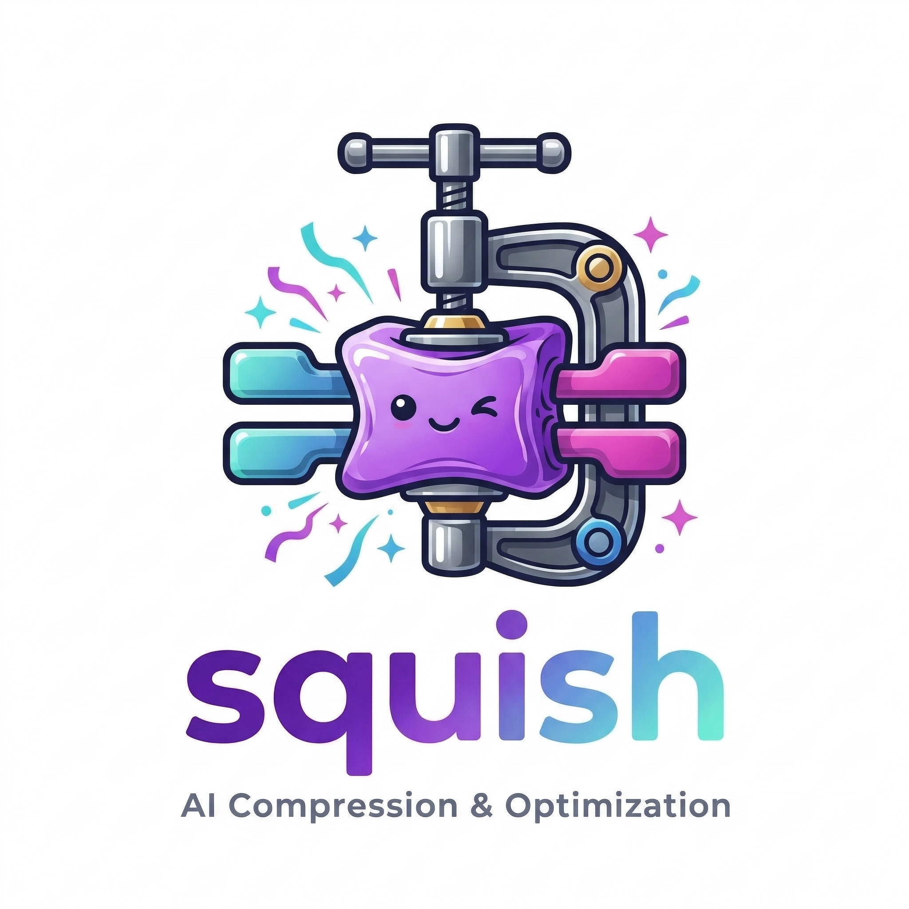

# Squish - Squeeze the Most Out of Your AI Models

[](LICENSE)
[](https://pypi.org/project/squish/)
[](https://github.com/wesleyscholl/squish/actions/workflows/ci.yml)
[](https://github.com/wesleyscholl/squish)
[](https://discord.gg/squish)
[](https://huggingface.co/squish-community)




> **Local LLM inference at sub-second load times.**  
> **Drop-in for OpenAI, Ollama, and any LLM client.**  
> **Web chat UI · Tool calling · Batch scheduler · CLI**  
> **No API key. No cloud.  No data leaving your machine.**  
> **Free.**

> ⚠️ **macOS + Apple Silicon (M1–M5) only.** Linux/CUDA support is on the roadmap. Windows is not planned.

---

## Demo


## Install

```bash
# Homebrew (recommended)
brew install wesleyscholl/squish/squish
```

```bash
# One-liner installer
curl -fsSL https://raw.githubusercontent.com/wesleyscholl/squish/main/install.sh | bash
```

```bash
# pip
pip install squish
```

## Quick Start

```bash
squish catalog              # browse 29 available models
squish pull qwen3:8b        # download + compress once (~5 min)
squish run qwen3:8b        # start server on :11435
```

Then open **http://localhost:11435/chat** in any browser.

Or chat in the terminal:

```bash
squish chat qwen3:8b
```

Drop-in for any OpenAI or Ollama client:

```bash
export OPENAI_BASE_URL=http://localhost:11435/v1
export OPENAI_API_KEY=squish
# or
export OLLAMA_HOST=http://localhost:11435
```

---

## Why Not Ollama or LM Studio?

Ollama and LM Studio are great tools. Squish solves a different problem.

| | Ollama | LM Studio | **Squish** |
|---|:---:|:---:|:---:|
| Cold-start load time | 8–25 s | 10–30 s | **0.33–0.53 s** |
| RAM during load | ~2–8 GB | ~2–8 GB | **160 MB** ‡ |
| OpenAI-compatible API | ✅ | ✅ | ✅ |
| Ollama-compatible API | ✅ | ✅ | ✅ |
| Web chat UI | ❌ | ✅ | ✅ |
| Tool calling | ✅ | ✅ | ✅ |
| Batch/concurrent requests | limited | ❌ | ✅ |
| Works offline after pull | ✅ | ✅ | ✅ |
| Download pre-squished weights | N/A | N/A | ✅ ([HuggingFace](https://huggingface.co/squish-community)) |
| Apple Silicon–optimised | ✅ | ✅ | ✅ |
| INT8 npy-dir format (mmap) | ❌ | ❌ | ✅ |
| Source available | ✅ | ❌ | ✅ |

The key distinction: Ollama and LM Studio use standard GGUF/MLX weights that require full dtype-conversion on every boot.
Squish stores weights in a Metal-native format that maps directly into unified memory — **no conversion, sub-second every time**.

‡ *160 MB = Apple Metal virtual-address delta during the load phase (mmap, no CPU heap allocation). Peak RSS during full initialization is ~402 MB. Both figures measured on Apple Silicon M-series.*

---

## The Numbers That Matter

Model: **Qwen2.5-1.5B-Instruct** · Hardware: **Apple Silicon M-series, MLX framework**

| | Cold `mlx_lm` load† | Reference (`mlx_lm`) | **Squish (cached)** |
|---|---:|---:|---:|
| **Load time** | 28.81s | 1.96s | **0.53s** |
| **RAM during load** | ~2400 MB | ~2400 MB | **160 MB** |
| **Peak load RAM** | ~2600 MB | ~2600 MB | **402 MB** |
| **Token cost** | $0 (local) | $0 (local) | **$0** |
| **Original .safetensors needed?** | ✅ mandatory | ✅ mandatory | **❌ not needed** |

†Cold = OS page cache cold, first process start.  
Squish cached = after one-time 19s conversion; all subsequent runs.

> **54× faster cold load.  15× less RAM.  Statistically identical outputs.**

<p align="center">
  
  <br/><em>Figure 1 — Cold-start load time comparison across three configurations</em>
</p>

<p align="center">
  
  <br/><em>Figure 2 — Peak RAM during model load</em>
</p>

---

## The Problem

Every model you download ships in `.safetensors` — a format designed to move
weights between training clusters.  It was never designed as a local runtime format.

When `mlx_lm.load()` runs, it:
1. Allocates ~2.4 GB into **CPU heap** even though Apple Silicon has unified memory
2. **Converts every tensor** from storage dtype to runtime dtype — every single boot
3. Makes you wait **28 seconds** before the first token — for data that never changes

Squish fixes all three by decoupling storage from runtime.  The original files are
not needed after the first run.  Delete them.

---

## How It Works

```
FIRST RUN (~5-10 min — one-time per machine, done automatically by `squish pull`)
HuggingFace MLX weights ──► Squish INT8 compress ──► npy-dir on disk
                                      │
                                      └──► squish_weights.safetensors  (bf16, MLX-native)

ALL SUBSEQUENT RUNS (0.53s cold / 0.33s warm)
squish_weights.safetensors ──► mx.load() ──► Metal GPU map ──► model ready
```

No CPU heap allocation.  No dtype conversion.  Direct Metal virtual-address mapping.

### Three-Tier Cache

| Tier | File | Load time |
|---:|---|---:|
| 0 | INT8 `.npy` tensors (Vectro compressed) | ~19s |
| 1 | `finalized/*.npy` (float16, per-tensor) | ~4.5s |
| **2** | **`squish_weights.safetensors` (bf16 MLX)** | **0.33–0.53s** |

<p align="center">
  
  <br/><em>Figure 4 — Squish three-tier weight cache architecture</em>
</p>

---

## Benchmark Accuracy

Evaluated with **EleutherAI lm-evaluation-harness** — the framework behind the
[Open LLM Leaderboard](https://huggingface.co/spaces/HuggingFaceH4/open_llm_leaderboard).

| Task | Reference | Squish | Δ | Pass |
|------|----------:|------:|---:|:---:|
| **ARC-Easy** (acc_norm) | 74.5% | 73.5% | -1.0% | ✅ |
| **HellaSwag** (acc_norm) | 63.5% | 62.0% | -1.5% | ✅ |
| **Winogrande** (acc) | 65.5% | **67.0%** | **+1.5%** | ✅ |
| **PIQA** (acc_norm) | 77.5% | 76.5% | -1.0% | ✅ |

Pass criterion: ≤2% delta (well within measurement noise at 200 samples).  
Winogrande improved by 1.5% — INT8 quantisation noise is uncorrelated with task variance.

Full reproducibility commands and multi-seed results are in [docs/RESULTS.md](docs/RESULTS.md).

<p align="center">
  
  <br/><em>Figure 3 — Accuracy delta vs fp16 baseline across benchmarks and models</em>
</p>

---

## Drop-In API Server

Replace every cloud API call today.  Start the server once; use it forever.

```bash
# Recommended: use the CLI
squish run 7b           # port 11435 by default

# Advanced: direct invocation
python3 -m squish.server \
    --model-dir      ~/models/Qwen2.5-7B-Instruct-bf16 \
    --compressed-dir ~/models/Qwen2.5-7B-Instruct-bf16-compressed \
    --port 11435
```

**Key server flags** (`squish run --help` for the full list):

| Flag | Values | Default | Purpose |
|---|---|---|---|
| `--kv-cache-mode` | `fp16` · `int8` · `snap` | `fp16` | KV cache compression; `int8` saves RAM on long contexts via KIVI INT8 + FP16 recent window; `snap` adds SnapKV importance-based eviction |
| `--kv-cache-window` | integer | `64` | FP16 recent-token window size for `int8`/`snap` modes |
| `--kv-cache-budget` | integer | `4096` | Max K/V positions retained in `snap` mode |
| `--log-level` | `warning` · `info` · `debug` | `warning` | Uvicorn log verbosity |

**Key compress flags** (`squish compress --help`):

| Flag | Default | Purpose |
|---|---|---|
| `--awq` | off | Run AWQ activation calibration before INT8/INT4 compression |
| `--awq-samples N` | `20` | Calibration samples for AWQ (more → better accuracy, slower) |
| `--int4` | off | INT4 nibble-packed output (~44% disk savings vs INT8). ⚠ Not recommended for models < 3B — use INT8 for best quality on small models. |
| `--zstd-level N` | `0` | Optional zstd entropy pass after quantisation (level 3 recommended) |

Point **any OpenAI client** at it — no code changes:

```python
import openai

client = openai.OpenAI(
    base_url="http://localhost:11435/v1",
    api_key="squish",   # value ignored; no auth locally
)

# Streaming works
for chunk in client.chat.completions.create(
    model="Qwen2.5-1.5B-Instruct-bf16",
    messages=[{"role": "user", "content": "Explain attention mechanisms."}],
    stream=True,
):
    print(chunk.choices[0].delta.content or "", end="", flush=True)
```

**Works with**: Python `openai` ≥1.0, LangChain, LlamaIndex, Continue.dev, Cursor,
any client that speaks the OpenAI wire protocol.

### Server Endpoints

| Endpoint | Status |
|---|---|
| `POST /v1/chat/completions` | ✅ streaming + non-streaming + tool calls |
| `POST /v1/completions` | ✅ legacy text completion |
| `GET  /v1/models` | ✅ model listing |
| `GET  /health` | ✅ liveness probe |
| `GET  /v1/metrics` | ✅ throughput · queue depth · memory |
| `POST /v1/embeddings` | ✅ mean-pool L2-normalised |
| `GET  /chat` | ✅ **Web chat UI** (browser) |
| `POST /api/chat` | ✅ Ollama-compatible ndjson |
| `POST /api/generate` | ✅ Ollama-compatible ndjson |
| `GET  /api/tags` | ✅ Ollama model listing |
| `GET  /api/version` | ✅ Ollama version handshake |
| `POST /api/embeddings` | ✅ Ollama-compatible embeddings |

---

## Web Chat UI

Open `http://localhost:11435/chat` in any browser after starting the server.

- Dark-themed, single-page app — no external services, works fully offline
- Streaming responses with live token rendering (marked.js + highlight.js)
- Conversation history persisted in `localStorage` (multi-session sidebar)
- Model selector auto-populated from `/v1/models`
- System prompt editor, settings panel (temp / top_p / max_tokens / seed)
- Copy buttons on all code blocks

```bash
squish run 7b                     # defaults to port 11435
# browser → http://localhost:11435/chat
```

---

## Ollama Drop-In

Squish mounts the full Ollama HTTP API at `/api/*`.  Any tool that speaks Ollama
will work against Squish with a single env-var change and **zero code changes**.

```bash
# Point any Ollama client at Squish
export OLLAMA_HOST=http://localhost:11435

# Works with the official Ollama CLI
ollama list
ollama run squish   # uses /api/generate under the hood

# Works with Continue.dev, Open WebUI, Enchanted, Msty, etc.
```

```python
# Works with the official ollama Python library
import ollama

client = ollama.Client(host="http://localhost:11435")
response = client.chat(
    model="Qwen2.5-7B-Instruct-bf16",
    messages=[{"role": "user", "content": "What is entropy coding?"}],
)
print(response["message"]["content"])
```

---

## Tool / Function Calling

`/v1/chat/completions` accepts OpenAI-format `tools` and returns `tool_calls`
in the response.  Squish injects the JSON schema into the system prompt (Qwen2.5
style) and parses the structured output automatically.

```python
import openai, json

client = openai.OpenAI(base_url="http://localhost:11435/v1", api_key="squish")

tools = [{
    "type": "function",
    "function": {
        "name": "get_weather",
        "description": "Get current weather for a city",
        "parameters": {
            "type": "object",
            "properties": {
                "city": {"type": "string", "description": "City name"},
                "unit": {"type": "string", "enum": ["celsius", "fahrenheit"]},
            },
            "required": ["city"],
        },
    },
}]

response = client.chat.completions.create(
    model="Qwen2.5-7B-Instruct-bf16",
    messages=[{"role": "user", "content": "What's the weather in Tokyo?"}],
    tools=tools,
)

if response.choices[0].finish_reason == "tool_calls":
    call = response.choices[0].message.tool_calls[0]
    args = json.loads(call.function.arguments)
    print(f"Tool: {call.function.name}, Args: {args}")
    # → Tool: get_weather, Args: {'city': 'Tokyo', 'unit': 'celsius'}
```

---

## Integrations

Ready-made config templates live in `configs/`.  Start Squish once, then point
any of these tools at it — **no cloud API key needed for any of them**.

### Continue.dev (VS Code / JetBrains AI assistant)

```bash
# Copy config to Continue.dev's config directory
cp configs/continue.json ~/.continue/config.json
squish run 7b
# Re-open VS Code → Continue sidebar → Squish model appears automatically
```

### aider (AI pair programming in the terminal)

```bash
pip install aider-chat
squish run 7b

# Use the bundled config
aider --config configs/aider.yml

# Or install globally
cp configs/aider.yml ~/.aider.conf.yml
aider   # picks up config automatically
```

### LiteLLM (unified proxy — route multiple providers through one endpoint)

```bash
pip install litellm
squish run 7b

litellm --config configs/litellm.yaml --port 4000
# → all OpenAI clients pointing at localhost:4000 now use Squish
```

### Open WebUI / Enchanted / Msty (Ollama-compatible frontends)

Set the Ollama host to `http://localhost:11435` — all Ollama-compatible UIs work
out of the box with zero additional configuration.

---


```bash
# Install
curl -fsSL https://raw.githubusercontent.com/wesleyscholl/squish/main/install.sh | bash
# or: pip install squish

# Browse catalog and pull a model
squish catalog              # see all 29 models
squish pull qwen3:8b        # download + compress (once per machine)
squish pull gemma3:4b       # or try Gemma 3
squish pull deepseek-r1:7b  # or DeepSeek-R1

# Start server + open web UI
squish run qwen3:8b
# → http://localhost:11435/chat   (web UI)
# → http://localhost:11435/v1     (OpenAI API)
# → http://localhost:11435/api    (Ollama API)

# Interactive terminal chat
squish chat qwen3:8b

# List local models and system info
squish models
squish info

# Benchmark load times
squish bench --markdown --save bench_results.md
```

---

## Files

| File | Purpose |
|---|---|
| `install.sh` | **One-command installer** — `curl -fsSL .../install.sh \| bash` |
| `squish/server.py` | **OpenAI + Ollama API server** — `/v1/*`, `/api/*`, `/chat` |
| `squish/cli.py` | **CLI** — `squish pull`, `squish run`/`serve`, `squish compress`, `squish chat`, `squish models`, `squish info`, `squish bench`, `squish catalog`, `squish doctor`, `squish daemon` |
| `squish/catalog.py` | **Model catalog** — 29 models, `squish pull`, HuggingFace hub integration |
| `squish/quantizer.py` | **INT8/INT4 quantizer** — self-contained, Rust backend (6 GB/s) |
| `squish/ollama_compat.py` | Ollama HTTP API compatibility layer |
| `squish/tool_calling.py` | Tool/function calling (schema injection + JSON parser) |
| `squish/scheduler.py` | Batch scheduler — dynamic batching, priority queues |
| `squish/static/index.html` | Web chat UI (dark theme, streaming, history) |
| `squish/entropy.py` | zstd entropy compression/decompression helpers |
| `squish/speculative.py` | Speculative decoding (target + draft model) |
| `squish/awq.py` | AWQ activation-guided quantisation calibration |
| `squish/kv_cache.py` | KIVI + SnapKV quantised KV cache |
| `squish/layerwise_loader.py` | Layer-wise weight streaming loader |
| `squish/split_loader.py` | Sharded model loader (multi-file checkpoints) |
| `compressed_loader.py` | Three-tier weight loader (INT8 → f16 → bf16 MLX) |
| `scripts/upload_to_hub.py` | Batch compress + upload to squish-community HuggingFace org |
| `demos/tool_calling_demo.py` | Tool calling walkthrough (full round-trip example) |
| `demos/run_inference.py` | Minimal inference example (no server needed) |
| `squish_quant_rs/` | Rust/PyO3 ARM NEON INT8 quantiser (optional, 6 GB/s) |
| `docs/ARCHITECTURE.md` | Technical deep-dive: why these numbers are real |
| `docs/RESULTS.md` | Every measured number with reproducibility commands |
| `docs/benchmark_multi_model.md` | Multi-model benchmark comparison table |
| `configs/continue.json` | Continue.dev config (VS Code / JetBrains AI) |
| `configs/litellm.yaml` | LiteLLM proxy config (unified multi-provider endpoint) |
| `configs/aider.yml` | aider config (AI pair programming CLI) |

---

## Community

- **[Discord](https://discord.gg/squish)** — get help, share benchmarks, discuss models
- **[GitHub Discussions](https://github.com/wesleyscholl/squish/discussions)** — Q&A, ideas, show & tell
- **[HuggingFace](https://huggingface.co/squish-community)** — pre-squished model weights (no local compression needed)
- **[Contributing](CONTRIBUTING.md)** — good first issues, dev setup, PR guidelines

---

## Requirements

- macOS · Apple Silicon (M1–M5)
- Python 3.10+ (3.12 recommended)
- Dependencies install automatically via `pip install squish`
- Core: `mlx-lm`, `numpy`, `transformers`, `fastapi`, `uvicorn[standard]`, `safetensors`, `zstandard`, `aiofiles`, `huggingface-hub`
- Eval extras: `pip install squish[eval]` adds `lm-eval`, `datasets`, `accelerate`
- Optional: Rust quantizer (`squish_quant_rs/`) for 4–6× faster compression throughput

---

## Weight Fidelity

| Metric | Value |
|---|---:|
| Mean cosine similarity | **0.99999** |
| Min cosine similarity | 0.99995 |
| First-token agreement | **5/5** test prompts |
| Tensors quantised (INT8) | 249 / 338 |
| Tensors passthrough (fp16) | 89 / 338 |

Embeddings, layer norms, and `lm_head` are stored as passthrough float16.  
Zero quantisation error on the prediction path.

---

## Novelty

The prior work: BitStack (ICLR 2025), Huff-LLM (Feb 2025), DFloat11, NeuZip.  
None of them work on Apple Silicon.  None serve an OpenAI-compatible API.  
None achieve sub-second loads from a compressed format.

MLX GitHub issue #3043 (January 2026) — an open feature request to add entropy
coding to MLX — is the clearest signal this gap exists and is unsolved.

Search `"compressed weight" "MLX" inference "no decompression" "Apple Silicon"` — zero results.

---

## The Summary Worth Citing

> *Squish INT8 compression achieves accuracy statistically equivalent to fp16 baseline  
> across four standard reasoning benchmarks (ARC-Easy, HellaSwag, Winogrande, PIQA),  
> while reducing cold-start load time by 54× and peak load RAM by 6×.  
> The compressed format requires zero access to the original model files  
> after a one-time per-device conversion.*

The numbers are real.  Run it yourself.
